<div align="center">
  
</div>

<div align="center">

<a href="https://www.linkedin.com/in/kashyap-nasit-5240b3341/"></a>
<a href="https://leetcode.com/Kashyap_Nasit_2007/"></a>
<a href="mailto:kashyapnasit12345@gmail.com.com"></a>

</div>


<br/>

<table align="center">
<tr>
<td width="55%" valign="top">

### Philosophy

> Every system hides a story.
> I enjoy discovering how it works,
> why it breaks,
> and how it can become better.

**Driven by curiosity. Guided by understanding. Defined by creation.**

</td>
<td width="45%" valign="top">

```bash
$ whoami
kashyap-nasit — cs-undergrad

$ status
role      : engineer-in-progress
focus     : ai · data · systems
location  : surat, gujarat, in
cgpa      : 7.71 / 10.00

$ mission
"engineering clarity from complexity"
```

</td>
</tr>
</table>


## Systems

<sub>Not projects — engineering systems, each solving a specific problem.</sub>

<br/>

<table>
<tr><td width="100%">

### 01 · Nexus — Attendance Intelligence

**Question** — Can attendance be logged accurately from a photo of a timetable, without manual entry?

**Architecture** — Timetable and attendance-sheet images pass through OCR to extract raw text, which is then interpreted by the Gemini Flash API to identify students, subjects, and presence — producing structured records stored in MongoDB.

**Engineering challenges** — Timetable layouts vary significantly across classes, which initially broke OCR parsing; the extraction logic had to be made layout-agnostic. A separate bug in the AI-generated attendance-percentage logic used an incorrect denominator, silently distorting results until it was traced and corrected.

**Outcome** — A working pipeline that turns unstructured classroom documents into reliable, queryable attendance data.

**Stack** — `Gemini Flash API` `OCR` `Node.js` `MongoDB`

</td></tr>
<tr><td width="100%">

### 02 · Construction Intelligence Platform

**Question** — Can raw financial documents and informal site updates be turned into structured operational knowledge?

**Architecture** — Transaction PDFs are auto-parsed into a structured database with an AI chatbot layered on top for querying. An LLM-driven ingestion pipeline is being built to read WhatsApp and Telegram messages from site workers and convert them into structured progress records, with human review for low-confidence extractions.

**Engineering challenges** — Informal, inconsistent field messages (typos, mixed language, shorthand) resist naive parsing — the pipeline needs a confidence-scoring layer rather than a binary parse/fail approach.

**Outcome** — A construction management platform where financial and operational data flow into one structured system instead of scattered documents and chat threads. *Currently under active development.*

**Roadmap** — WhatsApp integration · Telegram integration · Multi-agent extraction pipeline

**Stack** — `Next.js` `LLM Agents` `PDF Parsing` `MongoDB`

</td></tr>
<tr><td width="100%">

### 03 · Healthcare Management System

**Question** — How do you design a database layer that stays reliable as multiple modules read and write against it concurrently?

**Architecture** — A collaborative 4-person build; owned schema design, query optimization, and data integrity for the system's core workflows.

**Outcome** — A functioning healthcare management system with a database layer built to hold up under real multi-module usage.

**Stack** — `SQL` `Database Design`

</td></tr>
<tr><td width="100%">

### 04 · Silicon Lottery

**Question** — Why do two chips from the same production line perform differently?

**Architecture** — A Computer Organization & Architecture project simulating manufacturing variance in processor dies, and modeling how that variance produces the real-world phenomenon of chip binning.

**Outcome** — A working explanation, backed by simulation, of why hardware yield and overclocking headroom aren't uniform even within the same silicon batch.

**Stack** — `Computer Architecture` `Simulation`

</td></tr>
<tr><td width="100%">

### 05 · EV Analytics — Indian Market

**Question** — What do adoption and performance trends across India's EV market actually look like once the noise is cleaned out?

**Architecture** — Raw EV datasets cleaned and modeled, then visualized in an interactive Power BI dashboard covering range, charging behavior, and market growth.

**Outcome** — A dashboard that turns a messy public dataset into a clear, explorable view of the Indian EV landscape. Built for a data science course.

**Stack** — `Power BI` `Data Modeling` `DAX`

</td></tr>
<tr><td width="100%">

### 06 · Personal Portfolio

**Question** — What's the simplest, fastest way to represent my work without relying on a template?

**Architecture** — A responsive site built from scratch to showcase projects and background.

**Outcome** — My own space on the internet, built rather than templated.

**Stack** — `HTML` `CSS` `JavaScript`

</td></tr>
</table>


## Craft

<table>
<tr>
<td valign="top" width="20%">

**Languages**

C
C++
Java
Python
JavaScript
PHP
SQL
HTML / CSS

</td>
<td valign="top" width="20%">

**Backend**

Node.js
Express
MongoDB
MySQL
REST APIs
Git

</td>
<td valign="top" width="20%">

**AI**

OCR
Gemini API
Machine Learning
Scikit-Learn

</td>
<td valign="top" width="20%">

**Data Science**

Pandas
NumPy
Matplotlib
Streamlit
Power BI

</td>
<td valign="top" width="20%">

**Domains**

AI / ML
Business Analytics
System Design
Computer Networks
Computer Architecture

</td>
</tr>
</table>


## Current Exploration

<table>
<tr>
<td width="48%" align="center">

</td>
<td width="52%" align="center">

</td>
</tr>
</table>


## Signal

<div align="center">


<br/>


<br/><br/>

<picture>
  <source media="(prefers-color-scheme: dark)" srcset="https://raw.githubusercontent.com/kashyapnasit109/kashyapnasit109/output/snake-dark.svg" />
  
</picture>

<br/><br/>


<br/><br/>


<br/>


</div>


<div align="center">

<sub>Built from scratch — no template. Last structural update tracked via commit history.</sub>

</div>
