<!--
  Kashyap Nasit — profile README.
  Every visual is an animated SVG tile (assets/readme). The tiles are written back-to-back with align="top"
  so they render as one seamless canvas — keep the tags touching when editing (no blank lines, no spaces between them).
  The Signal panels are regenerated twice a day by .github/workflows/signal.yml into the `output` branch.
-->

<a
 href="https://kashyap-portfolio-site.vercel.app/">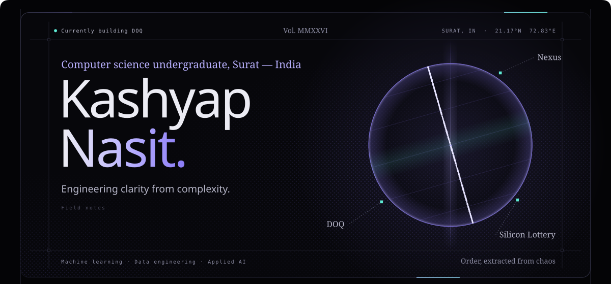</a><a
 href="https://leetcode.com/u/Kashyap_Nasit_2007/">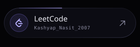</a>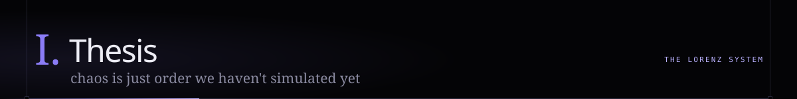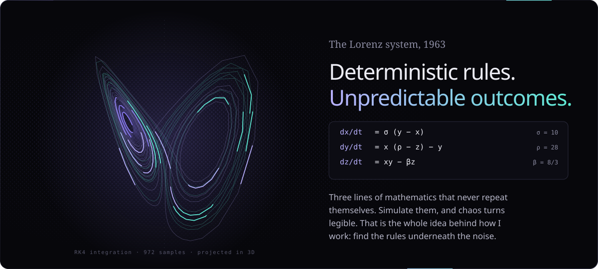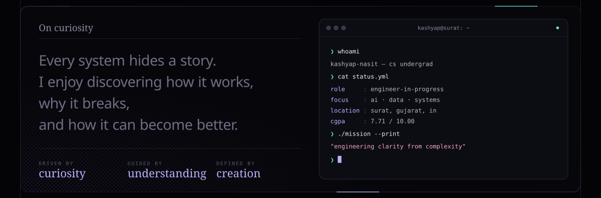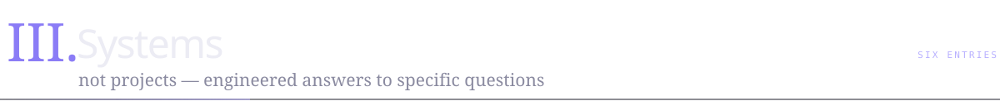<a
 href="https://github.com/kashyapnasit109/Nexus">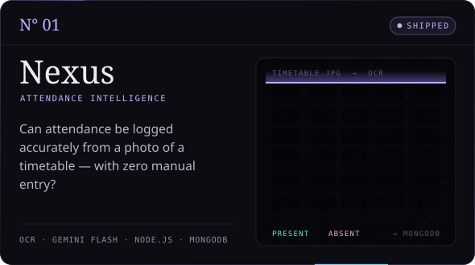</a><a
 href="https://github.com/kashyapnasit109/DOQ_KB">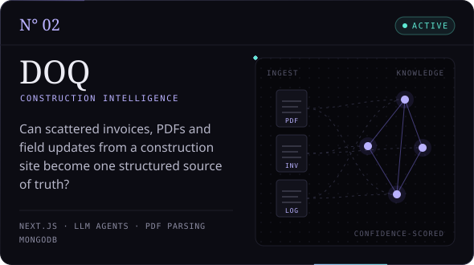</a><a
 href="https://github.com/kashyapnasit109/Silicon-Lottery">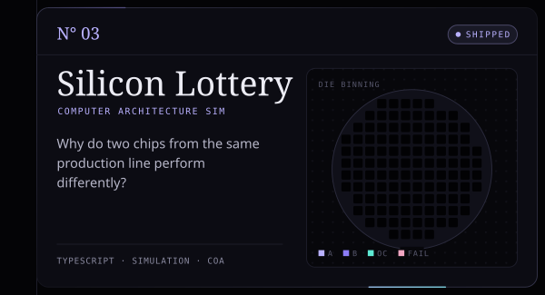</a>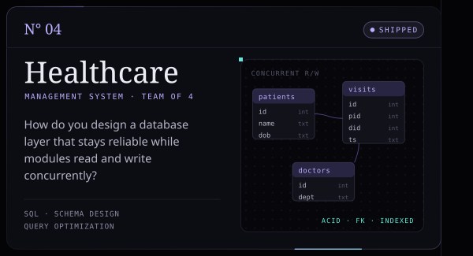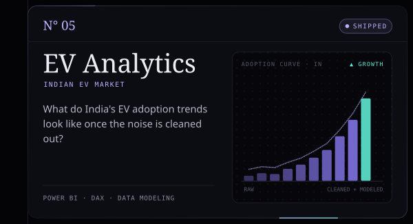<a
 href="https://kashyap-portfolio-site.vercel.app/">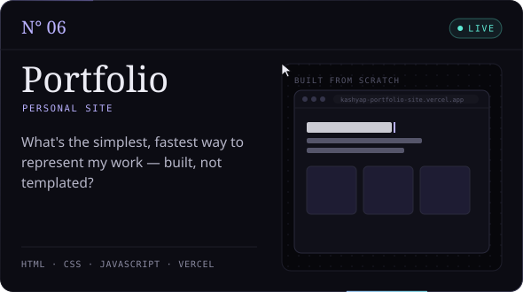</a>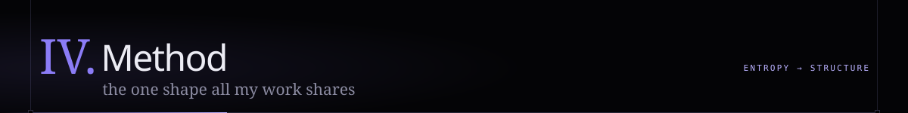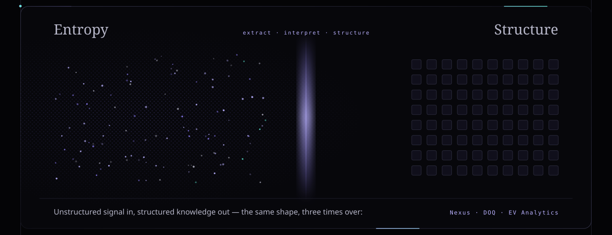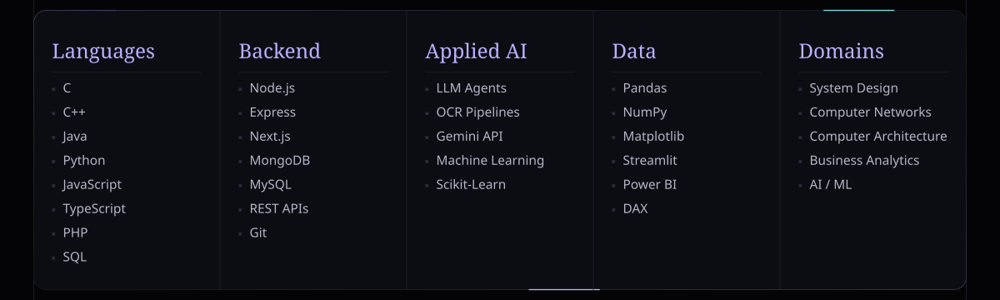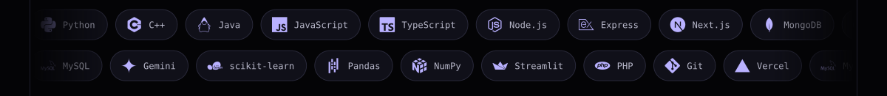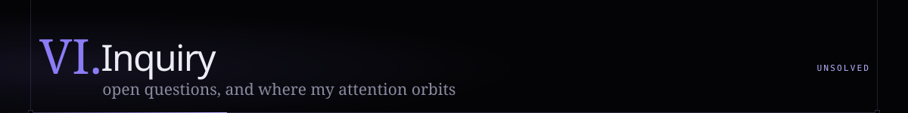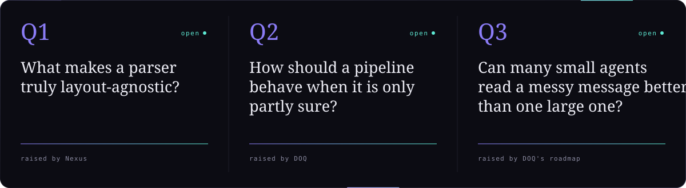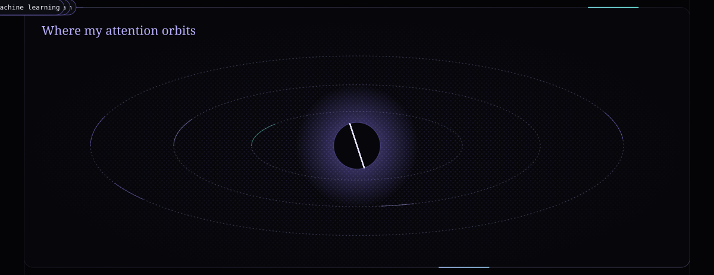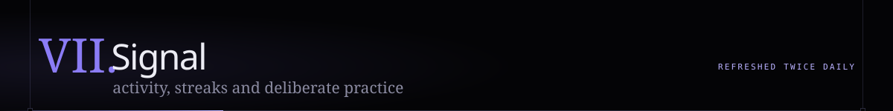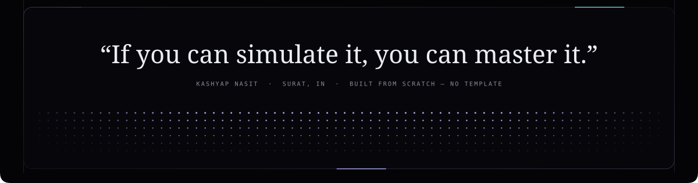

 

Field notes — the long version of each system

<b>No. 01 — Nexus · field notes</b>

 

> **Question** — Can attendance be logged accurately from a photo of a timetable, without manual entry?
>
> **Architecture** — Timetable and attendance-sheet images pass through OCR to extract raw text, which is then interpreted by the Gemini Flash API to identify students, subjects and presence — producing structured records stored in MongoDB.
>
> **Engineering challenges** — Timetable layouts vary significantly across classes, which initially broke OCR parsing; the extraction logic had to be made layout-agnostic. A separate bug in the AI-generated attendance-percentage logic used an incorrect denominator, silently distorting results until it was traced and corrected.
>
> **Outcome** — A working pipeline that turns unstructured classroom documents into reliable, queryable attendance data.
>
> `Gemini Flash API` `OCR` `Node.js` `MongoDB` · [repository →](https://github.com/kashyapnasit109/Nexus)

<b>No. 02 — DOQ — Construction Intelligence Platform · field notes</b>

 

> **Question** — Can raw financial documents and informal site updates be turned into structured operational knowledge?
>
> **Architecture** — Transaction PDFs are auto-parsed into a structured database with an AI chatbot layered on top for querying. An LLM-driven ingestion pipeline is being built to read WhatsApp and Telegram messages from site workers and convert them into structured progress records, with human review for low-confidence extractions.
>
> **Engineering challenges** — Informal, inconsistent field messages (typos, mixed language, shorthand) resist naive parsing — the pipeline needs a confidence-scoring layer rather than a binary parse/fail approach.
>
> **Outcome** — A construction management platform where financial and operational data flow into one structured system instead of scattered documents and chat threads. *Currently under active development.*
>
> **Roadmap** — WhatsApp integration · Telegram integration · Multi-agent extraction pipeline
>
> `Next.js` `LLM Agents` `PDF Parsing` `MongoDB` · [repository →](https://github.com/kashyapnasit109/DOQ_KB)

<b>No. 03 — Silicon Lottery · field notes</b>

 

> **Question** — Why do two chips from the same production line perform differently?
>
> **Architecture** — A Computer Organization & Architecture project simulating manufacturing variance in processor dies, and modeling how that variance produces the real-world phenomenon of chip binning.
>
> **Outcome** — A working explanation, backed by simulation, of why hardware yield and overclocking headroom aren't uniform even within the same silicon batch.
>
> `Computer Architecture` `Simulation` `TypeScript` · [repository →](https://github.com/kashyapnasit109/Silicon-Lottery)

<b>No. 04 — Healthcare Management System · field notes</b>

 

> **Question** — How do you design a database layer that stays reliable as multiple modules read and write against it concurrently?
>
> **Architecture** — A collaborative 4-person build; I owned schema design, query optimization and data integrity for the system's core workflows.
>
> **Outcome** — A functioning healthcare management system with a database layer built to hold up under real multi-module usage.
>
> `SQL` `Database Design`

<b>No. 05 — EV Analytics — Indian Market · field notes</b>

 

> **Question** — What do adoption and performance trends across India's EV market actually look like once the noise is cleaned out?
>
> **Architecture** — Raw EV datasets cleaned and modeled, then visualized in an interactive Power BI dashboard covering range, charging behavior and market growth.
>
> **Outcome** — A dashboard that turns a messy public dataset into a clear, explorable view of the Indian EV landscape. Built for a data science course.
>
> `Power BI` `Data Modeling` `DAX`

<b>No. 06 — Personal Portfolio · field notes</b>

 

> **Question** — What's the simplest, fastest way to represent my work without relying on a template?
>
> **Architecture** — A responsive site built from scratch to showcase projects and background.
>
> **Outcome** — My own space on the internet, built rather than templated.
>
> `HTML` `CSS` `JavaScript` · [live site →](https://kashyap-portfolio-site.vercel.app/) · [repository →](https://github.com/kashyapnasit109/Personal_Portfolio)

